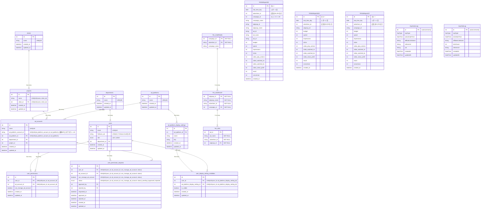

# ER図（広告管理・権限管理・媒体・レポート）

```mermaid
erDiagram
   departments {
       int id PK
       string name "UNIQUE"
       datetime created_at
       datetime updated_at
   }
   users {
       int id PK
       string email "UNIQUE"
       string firebase_uid "UNIQUE, Firebase AuthのUID"
       enum role "user | admin"
       int department_id FK
       datetime created_at
       datetime updated_at
   }
   ad_accounts {
       int id PK
       string name "UNIQUE"
       string ad_platform_account_id "UNIQUE(ad_platform_account_id, ad_platform), 媒体API上のアカウントID"
       int ad_platform_id FK "UNIQUE(ad_platform_account_id, ad_platform)"
       int department_id FK
       int project_id FK
       datetime created_at
       datetime updated_at
   }
   ad_platforms {
            int id PK
            string name "UNIQUE"
            datetime created_at
       datetime updated_at
   }
   ad_platform_display_settings {
       int id PK
       int ad_platform_id FK
       string name
       string key
       datetime created_at
       datetime updated_at
   }
   user_display_setting_visibilities {
       int id PK
       int user_id FK "UNIQUE(user_id, ad_platform_display_setting_id)"
       int ad_platform_display_setting_id FK "UNIQUE(user_id, ad_platform_display_setting_id)"
       boolean is_visible
       datetime created_at
       datetime updated_at
   }
   user_permissions {
       int id PK
       int user_id FK "UNIQUE(user_id, ad_account_id)"
       int ad_account_id FK "UNIQUE(user_id, ad_account_id)"
       boolean can_manage_ad_account
       datetime created_at
       datetime updated_at
   }
   user_permission_requests {
            int id PK
            int user_id FK "UNIQUE(user_id, ad_account_id, can_manage_ad_account, status)"
            int ad_account_id FK "UNIQUE(user_id, ad_account_id, can_manage_ad_account, status)"
            boolean can_manage_ad_account "UNIQUE(user_id, ad_account_id, can_manage_ad_account, status)"
            enum status "UNIQUE(user_id, ad_account_id, can_manage_ad_account, status), pending | approved | rejected"
            int approved_by FK
            int rejected_by FK
            datetime requested_at
       datetime approved_at
       datetime rejected_at
       datetime created_at
       datetime updated_at
   }
   projects {
       int id PK
       string name "UNIQUE(name, client_id)"
       int client_id FK "UNIQUE(name, client_id)"
       datetime created_at
       datetime updated_at
   }
   clients {
       int id PK
       string name "UNIQUE"
       datetime created_at
       datetime updated_at
   }
    TIK_CAMPAIGN {
        int campaign_id PK   "NOT NULL"
        string advertiser_id FK   "NOT NULL"
        string campaign_name
    }
    TIK_ADGROUP {
        int adgroup_id PK        "NOT NULL"
        string adgroup_name     "NOT NULL"
        string advertiser_id    "NOT NULL"
        int campaign_id FK      "NOT NULL"
    }
    TIK_ADS {
        int ad_id PK
        string ad_name              "NOT NULL"
        string advertiser_id        "NOT NULL"
        int adgroup_id  FK          "NOT NULL"
    }
    TikTokReportAD {
        int    id PK                   "主キー"
        date   stat_time_day           "レポート日"
        int    advertiser_id           "広告主ID (FKなど)"
        int    campaign_id             "キャンペーンID"
        string campaign_name
        string adgroup_id
        string adgroup_name
        string ad_id
        string ad_name
        string ad_url
        int    budget
        int    spend
        int    impressions
        int    clicks
        int    video_play_actions
        int    video_watched_2s
        int    video_watched_6s
        int    video_views_p100
        int    reach
        int    conversion
        datetime    created_at
    }
    TikTokReportADG {
        int    id PK                   "主キー"
        date   stat_time_day           "レポート日"
        int    advertiser_id           "広告主ID (FKなど)"
        string adgroup_id
        int    budget
        int    spend
        int    impressions
        int    clicks
        int    video_play_actions
        int    video_watched_2s
        int    video_watched_6s
        int    video_views_p100
        int    reach
        int    conversion
        datetime    created_at
    }
    TikTokReportCP {
        int    id PK                   "主キー"
        date   stat_time_day           "レポート日"
        int    advertiser_id           "広告主ID (FKなど)"
        string campaign_id
        int    budget
        int    spend
        int    impressions
        int    clicks
        int    video_play_actions
        int    video_watched_2s
        int    video_watched_6s
        int    video_views_p100
        int    reach
        int    conversion
        datetime    created_at
    }
     AspActionLog {
        Int id PK "autoincrement()"
        AspType aspType
        DateTime actionDateTime
        String affiliateLinkName
        String referrerUrl
        String uid
        DateTime createdAt
        DateTime updatedAt
    }
    AspClickLog {
        Int id PK "autoincrement()"
        AspType aspType
        DateTime clickDateTime
        String affiliateLinkName
        Int clickCount
        String referrerUrl
        DateTime createdAt
        DateTime updatedAt
    }
   departments ||--|{ users : "has many"
   departments ||--|{ ad_accounts : "has many"
   clients ||--|{ projects : "has many"
   projects ||--|{ ad_accounts : "has many"
   ad_platforms ||--|{ ad_accounts : "has many"
   ad_platforms ||--|{ ad_platform_display_settings : "has many"
   ad_platform_display_settings ||--|{ user_display_setting_visibilities : "has many"
   users ||--|{ user_display_setting_visibilities : "has many"
   users ||--|{ user_permissions : "has many"
   ad_accounts ||--|{ user_permissions : "has many"
   users ||--|{ user_permission_requests : "has many"
   ad_accounts ||--|{ user_permission_requests : "has many"
    TIK_CAMPAIGN ||--|{ TIK_ADGROUP : "1 to many"
    TIK_ADGROUP ||--|{ TIK_ADS : "1 to many"
```
